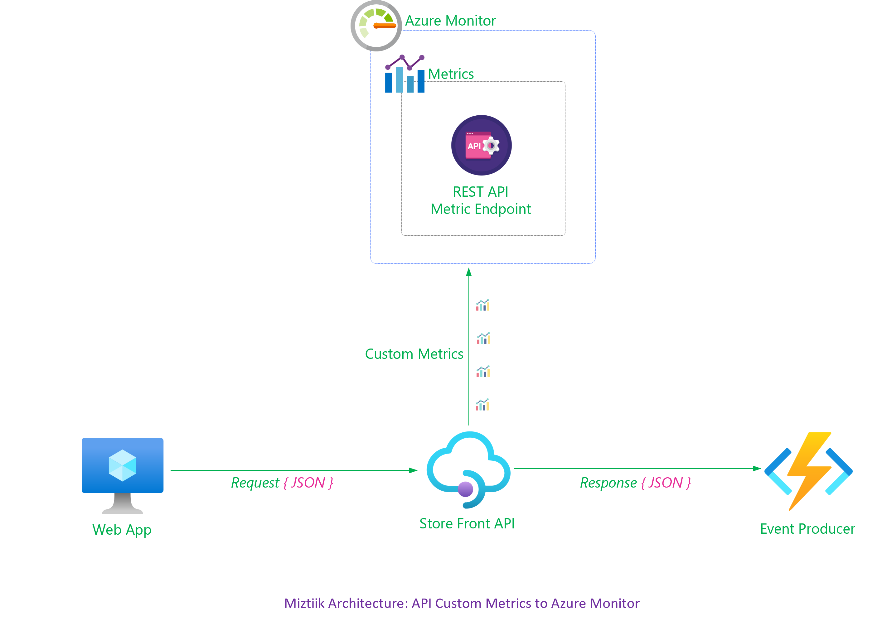
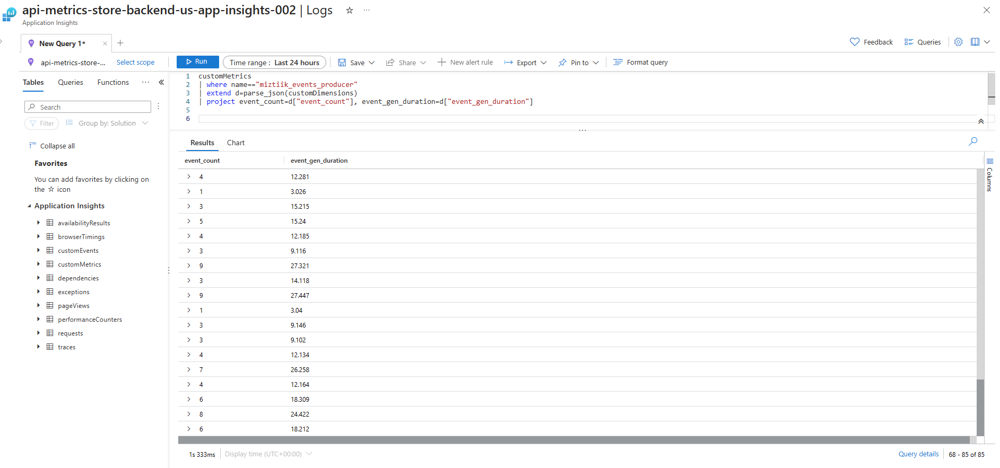
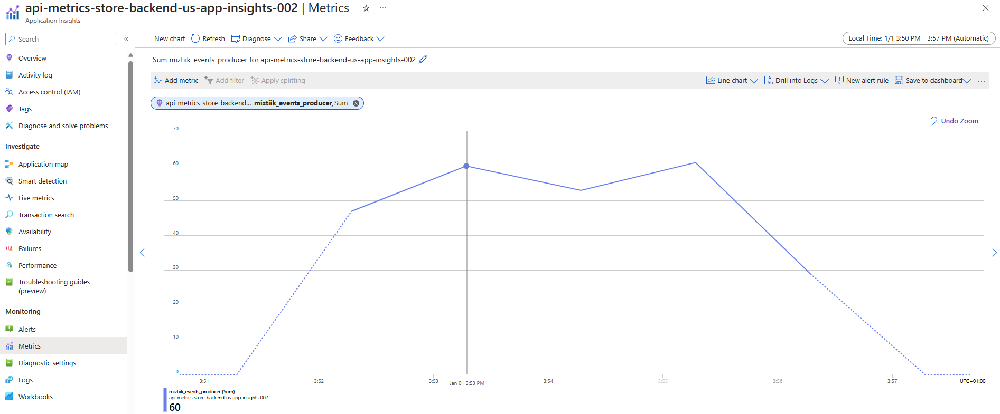

# Publish Custom API Metrics to Azure Monitor from APIM

The application team needs to actively monitor key business metrics for the API. For instance, when dealing with an API that processes store orders, it becomes crucial to track metrics such as the number of orders and the order failure rate.

Developers have the choice of publishing custom metrics directly to [Azure Monitor Custom Metrics][2]. At times you will not be to modify the code or want a light weight solution. In that case, Developers are able to publish them using APIM's [Custom Metric Policy][1] to surface them Azure Monitor and trigger alerts based on them. These metrics are published against an particular API resource and are availebl in the Application Insights workspace connected to the API.



In our case, we will using the following three metrics,
```xml
<emit-metric name="miztiik_events" value="1" namespace="miztiik-api-metrics">
    <dimension name="event_count" value="1" />
</emit-metric>

<emit-metric name="miztiik_events_producer" value="1" namespace="miztiik-api-metrics">
    <dimension name="event_count" value="@(context.Response.Body.As<JObject>(preserveContent: true)["resp"]["tot_msgs"].ToString())" />
    <dimension name="event_gen_duration" value="@(context.Response.Body.As<JObject>(preserveContent: true)["resp"]["event_gen_duration"].ToString())" />
</emit-metric>
<choose>
    <when condition="@(context.Response.StatusCode >= 200 && context.Response.StatusCode < 300)">
        <emit-metric name="miztiik_events_produce_resp" value="1" namespace="miztiik-api-metrics">
            <dimension name="API" value="@(context.Api.Name)" />
            <dimension name="Client IP" value="@(context.Request.IpAddress)" />
            <dimension name="Status Code" value="@((String)context.Response.StatusCode.ToString())" />
            <dimension name="Status Reason" value="@(context.Response.StatusReason)" />
        </emit-metric>
    </when>   
</choose>
```

1. **Metric: miztiik_events** - A simple one with no transformation
2. **Metric: event_gen_duration** - Parses the outgoing JSON response and extracts the `event_count` and `event_gen_duration` values
3. **Metric: miztiik_events_produce_resp** - A metric that is ingested based on a condition(_`StatusCode` in this case)

# Create the Resources.

The bicep template will create the following resources: Azure Function App, API Management, Backend Service and the APIM Policy for configuring the backend. We have not configured the APIM to use the client certificate yet.

```bash
make all
```

## 🎯 Test the solution

The API Url should be of the format `https://custom-metrics-store-front-us-apim-006.azure-api.net/api/store-events-producer`


```bash
LOAD_COUNT=250
TARGET_HOST="https://api-metrics-store-front-us-apim-002.azure-api.net/api/store-events-producer-fn"
for ((i=1; i<=LOAD_COUNT; i++)); do
    COUNT=$((1 + ${RANDOM} % 10))
    curl -s "${TARGET_HOST}?count=${COUNT}" &
    echo -e "Request: (${i}/${LOAD_COUNT}) with event count:${COUNT} ----"
    sleep 1 
done
```

### 🧪 Analyze the results



 
1. ## 🧹 CleanUp

   If you want to destroy all the resources created by the stack, Execute the below command to delete the stack, or _you can delete the stack from console as well_

   - Resources created during [Deploying The Solution](#-deploying-the-solution)
   - _Any other custom resources, you have created for this demo_

   ```bash
   # Delete from resource group
   az group delete --name Miztiik_Enterprises_xxx --yes
   # Follow any on-screen prompt
   ```

   This is not an exhaustive list, please carry out other necessary steps as maybe applicable to your needs.

## 📌 Who is using this

This repository aims to show how to Bicep to new developers, Solution Architects & Ops Engineers in Azure.

### 💡 Help/Suggestions or 🐛 Bugs

Thank you for your interest in contributing to our project. Whether it is a bug report, new feature, correction, or additional documentation or solutions, we greatly value feedback and contributions from our community. [Start here](/issues)

### 👋 Buy me a coffee

[](https://ko-fi.com/Q5Q41QDGK) Buy me a [coffee ☕][900].

### 📚 References

1. [Azure Docs - APIM Emit custom metrics policy][1]
1. [Azure Docs - Monitor Custom Metric][2]


[1]: https://learn.microsoft.com/en-us/azure/api-management/emit-metric-policy
[2]: https://learn.microsoft.com/en-us/azure/azure-monitor/essentials/metrics-custom-overview

### 🏷️ Metadata


**Level**: 100

[100]: https://www.udemy.com/course/aws-cloud-security/?referralCode=B7F1B6C78B45ADAF77A9
[101]: https://www.udemy.com/course/aws-cloud-security-proactive-way/?referralCode=71DC542AD4481309A441
[102]: https://www.udemy.com/course/aws-cloud-development-kit-from-beginner-to-professional/?referralCode=E15D7FB64E417C547579
[103]: https://www.udemy.com/course/aws-cloudformation-basics?referralCode=93AD3B1530BC871093D6
[899]: https://www.udemy.com/user/n-kumar/
[900]: https://ko-fi.com/miztiik
[901]: https://ko-fi.com/Q5Q41QDGK